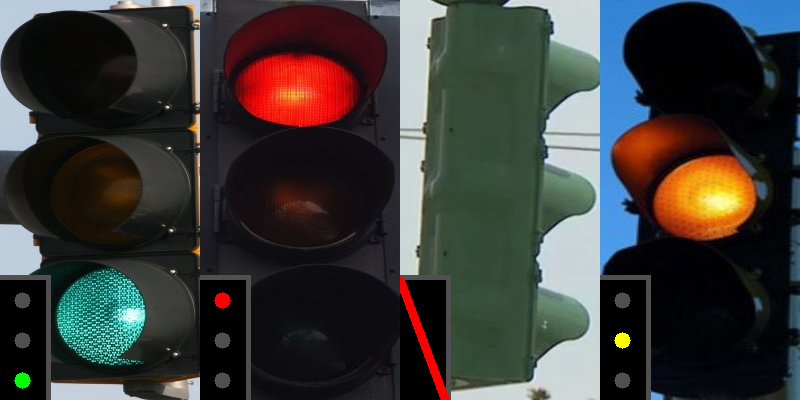

# traffic-light-classifier
Projekt realizowany na przedmiot Integracja Programowa Systemów Multimedialnych 1, Wydział Mechatroniki, rok ak. 2021/2022.

Projekt zakłada utworzenie klasyfikatora świateł drogowych (sygnalizacji świetlnej) w postaci sieci konwolucyjnej. Rozpoznawane są klasy: *ZIELONE*, *ŻÓŁTE*, *CZERWONE*, *INNE* (np. widok sygnalizatora z boku). Do trzech klas podstawowych wykorzystany został [zbiór danych LISA](https://www.kaggle.com/datasets/mbornoe/lisa-traffic-light-dataset), do klasy *INNE* [zbiór danych z symulatora CARLA](https://www.kaggle.com/datasets/sachsene/carla-traffic-lights-images). 

## Wizualizacja
Wizualizacja uruchamiana jest poprzez polecenie:
```shell
python main.py
```
Wynik wizualizacji:
<p align="center">
	
</p>

## Środowisko
Biblioteki zainstalować można poprzez:
```shell
python -m pip install -r requirements.txt
```

## Pliki
Notatnik [train.py](train.py) jest notatnikiem służącym do trenowania modelu. W pliku [preprocessing.py](preprocessing.py) znajduje się algorytm przetwarzania danych. Plik [visualization.py](visualization.py) zawiera funkcję służącą do rysowania wizualizacji. Pliki [convert_LISA.py](convert_LISA.py) oraz [convert_CARLA.py](convert_CARLA.py) są skryptami służącymi do przetwarzania surowych zbiorów danych.


W repozytorum nie jest załączony model (ograniczenia Githuba).
